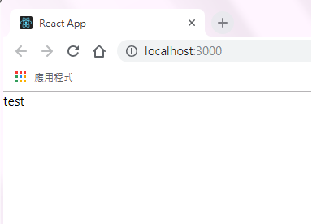
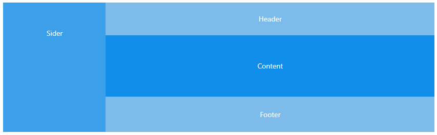
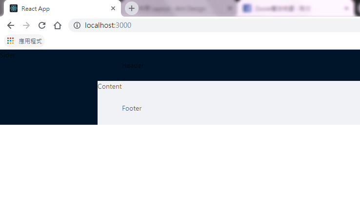
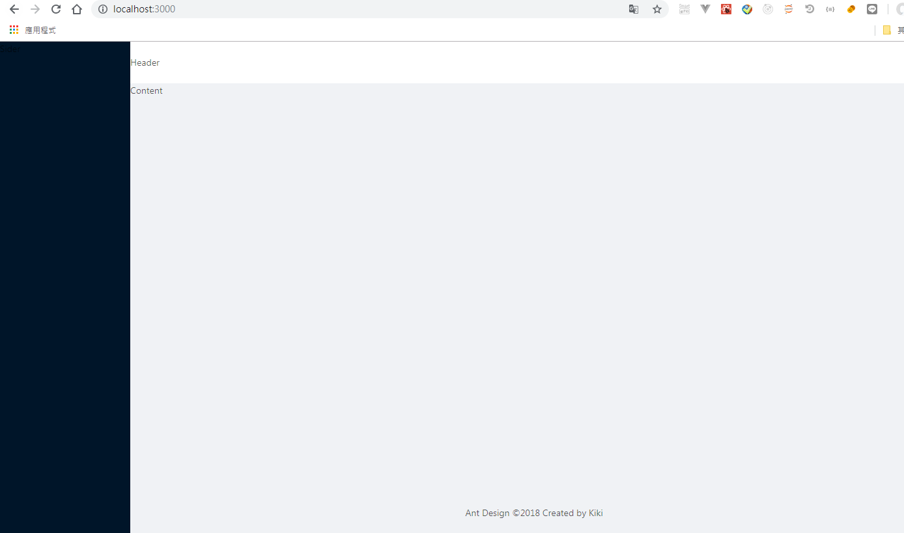

# 02.Layout 設置

## :checkered_flag: 關卡目標

1. Layout 設定: Header、Content、Footer

### Step 1. src下建立layouts資料夾
### Step 2. 建立 BasicLayout.jsx
### Step 3. 編輯 BasicLayout.jsx

```js
import React from 'react';
//新增一個BasicLayout 的 React Component
class BasicLayout extends React.Component {
  render() {
    return (
     <div>test</div>
    );
  }
}
export default BasicLayout;
```

### Step 4. 編輯 App.js


```js
import React, { Component } from 'react';
import BasicLayout from './layouts/BasicLayout';
//將BasicLayout 載入
  class App extends Component {
    render() {
      return (
        <div className="App">
        <BasicLayout></BasicLayout>
        </div>
      );
    }
  }

export default App;
```
### Step 5. 確認畫面有顯示test


### Step 6. 編輯 BasicLayout.jsx 開始加入Layout
Layout 使用方式參考說明:(https://ant.design/components/layout-cn/)

我們預設會使用這個下圖的樣版



```js
import React from 'react';
import { Layout } from 'antd';

class BasicLayout extends React.Component {
  render() {
    const { Header, Footer, Sider, Content } = Layout;
    return (
      <Layout>
        <Sider>Sider</Sider>
        <Layout>
          <Header>Header</Header>
          <Content>Content</Content>
          <Footer>Footer</Footer>
        </Layout>
      </Layout>
    );
  }
}
export default BasicLayout;
```
瀏覽器會顯示




### Step 7. 修改設定

1. 調整Sider的高度、寬度
2. header 背景顏色
3. footer 說明


```js
import React from 'react';
import { Layout } from 'antd';

class BasicLayout extends React.Component {
  render() {
    const { Header, Footer, Sider, Content } = Layout;
    return (
      <Layout >
        <Sider style={{ width: 256, minHeight: '100vh' }}>Sider</Sider>
        <Layout>
          <Header style={{ background: '#fff', padding: 0 }}> Header</Header>
          <Content>Content</Content>
          <Footer style={{ textAlign: 'center' }}> Ant Design ©2018 Created by Kiki</Footer>
        </Layout>
      </Layout>
    );
  }
}
export default BasicLayout;

```

