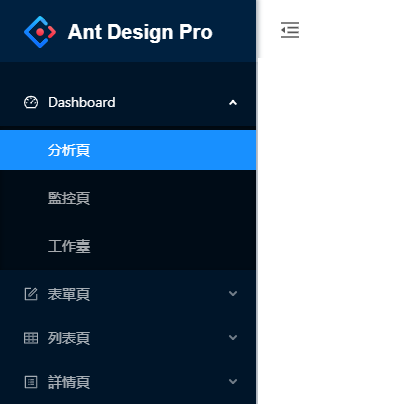
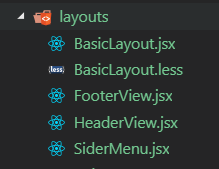
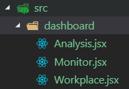

# 03.Sider 設置

## :checkered_flag: 關卡目標

1. Sider 設定: menu 內容設定可折壘
2. menu 按下可連結畫面

### Step 1. 設定menu
menu 元件說明參考(https://ant.design/components/menu-cn/)

參考ant design pro 畫面





程式碼:產生menu

```js
import React from 'react';
import { Layout, Menu, Icon } from 'antd';

class BasicLayout extends React.Component {
  render() {
    const { Header, Footer, Sider, Content } = Layout;
    const SubMenu = Menu.SubMenu;
    return (
      <Layout >
        <Sider style={{ width: 256, minHeight: '100vh' }}>
          <Menu
            mode="inline"
            theme="dark"
          >
            <SubMenu key="sub1" title={<span><Icon type="dashboard" /><span>Dashboard</span></span>}>
              <Menu.Item key="1">分析頁</Menu.Item>
              <Menu.Item key="2">監控頁</Menu.Item>
              <Menu.Item key="3">工作臺</Menu.Item>
            </SubMenu>
          </Menu>
        </Sider>
        <Layout>
          <Header style={{ background: '#fff', padding: 0 }}> Header</Header>
          <Content>Content</Content>
          <Footer style={{ textAlign: 'center' }}> Ant Design ©2018 Created by Kiki</Footer>
        </Layout>
      </Layout>
    );
  }
}
export default BasicLayout;

```

### Step 2. 讓Sider可折壘、header 按鈕產生
1. 設定Sider屬性 collapsed=true 收起來
2. header 上設定icon 按鈕
3. 當按下按鈕就折壘, toggleCollapsed 事件


```js
import React from 'react';
import { Layout, Menu, Icon } from 'antd';
class BasicLayout extends React.Component {
  state = {
    collapsed: false,
  }

  toggleCollapsed = () => {
    this.setState({
      collapsed: !this.state.collapsed,
    });
  }
  render() {
    const { Header, Footer, Sider, Content } = Layout;
    const SubMenu = Menu.SubMenu;
    return (
      <Layout >
        <Sider style={{ width: 256, minHeight: '100vh' }}
          collapsed={this.state.collapsed}
         >
          <Menu
            mode="inline"
            theme="dark"
          >
            <SubMenu key="sub1" title={<span><Icon type="dashboard" /><span>Dashboard</span></span>}>
              <Menu.Item key="1">分析頁</Menu.Item>
              <Menu.Item key="2">監控頁</Menu.Item>
              <Menu.Item key="3">工作臺</Menu.Item>
            </SubMenu>
          </Menu>
        </Sider>
        <Layout>
          <Header style={{ background: '#fff', padding: 0 }}>
          <Icon
              className="trigger"
              type={this.state.collapsed ? 'menu-unfold' : 'menu-fold'}
              onClick={this.toggleCollapsed}
            />
          </Header>
          <Content>Content</Content>
          <Footer style={{ textAlign: 'center' }}> Ant Design ©2018 Created by Kiki</Footer>
        </Layout>
      </Layout>
    );
  }
}
export default BasicLayout;


```
### Step 3. header 按鈕css 設定
1. 產生BasicLayout.less
2. 設定按下折壘按鈕顏色
3. BasicLayout.jsx 載入 import './BasicLayout.less'


```less
.trigger {
    font-size: 18px;
    line-height: 64px;
    padding: 0 24px;
    cursor: pointer;
    transition: color .3s;
  }
.trigger:hover {
    color: #1890ff;
}

```
### Step 4. 重構BasicLayout程式碼
1. BasicLayout 將header、sider、footer 都拆成組件,Basiclayout程式碼好維護
2. 產生




```js
import React from 'react';
import { Layout } from 'antd';
import './BasicLayout.less';
import FooterView from './FooterView';
import HeaderView from './HeaderView';
import SiderMenu from './SiderMenu';
class BasicLayout extends React.Component {
  render() {
    const { Content } = Layout;
    return (
      <Layout >
        <SiderMenu></SiderMenu>
        <Layout>
          <HeaderView />
          <Content></Content>
          <FooterView />
        </Layout>
      </Layout>
    );
  }
}
export default BasicLayout;

```


### Step 5. 安裝 react-router-dom
```js
yarn add react-router-dom
```
1. react-router-dom用於DOM 绑定的 React Router React Router


### Step 6. menu 設定link有超連結的功能

1. Link组件用於取代< a >元素，產成一個連結，當點擊後跳轉到另一個路由。基本上就是< a >元素的React 版本，可以接收Router的狀態。

```js
<Menu mode="inline" theme="dark">
            <SubMenu key="sub1" title={<span><Icon type="dashboard" /><span>Dashboard</span></span>}>
              <Menu.Item key="1"><Link to="/analysis">分析頁</Link></Menu.Item>
              <Menu.Item key="2"><Link to="/monitor">監控頁</Link></Menu.Item>
              <Menu.Item key="3"><Link to="/workplace">工作臺</Link></Menu.Item>
            </SubMenu>
</Menu>
```


### Step 7. 產生點選menu 需顯示頁面



```js
import React from 'react';
class Analysis extends React.Component {
  render() {
    return (
      <div>
       Analysis
      </div>
    );
  }
}
export default Analysis;
```


```js
import React from 'react';
class Monitor extends React.Component {
  render() {
    return (
      <div>
       Monitor
      </div>
    );
  }
}
export default Monitor;
```


```js
import React from 'react';
class Workplace extends React.Component {
  render() {
    return (
      <div>
       Workplace
      </div>
    );
  }
}
export default Workplace;
```


### Step 8. BasicLayout.jsx設定route

1.  < Switch >是唯一的因为它權權只會渲染一個路徑,
   如果URL是/analysis，< Switch >將會開始尋找相匹配的< Route >。
   <Route path="/analysis" />將被匹配到，緊接著 < Switch >會停止繼續匹配,並顯示< About >。
   同理，如果URL是/monitor，那麼< Monitor >將會被顯示。

```js
import { Switch, Route } from 'react-router-dom'


<Switch>
              <Route exact path='/' component={Analysis} />
              <Route path='/analysis' component={Analysis} />
              <Route path='/monitor' component={Monitor} />
              <Route path='/workplace' component={Workplace} />
</Switch>
```


### Step 9. 設定app.js

1.< BrowserRouter >：使用 HTML5 提供的 history API 来保持 UI 和 URL 的同步

```js

import React, { Component } from 'react';
import BasicLayout from './layouts/BasicLayout';

import { BrowserRouter  } from "react-router-dom";

  class App extends Component {
    render() {
      return (
       <BrowserRouter>
        <div className="App">
          <BasicLayout/>
        </div>
       </BrowserRouter>
      );
    }
  }

export default App;

```