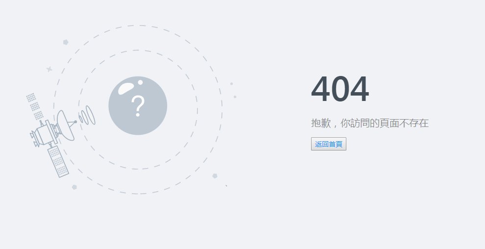
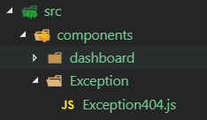

# 04.Exception設置

## :checkered_flag: 關卡目標

1. 當連結到不存在網頁時會秀出:抱歉，你訪問的頁面不存在



### Step 1. 產生404頁面
1. Exception 元件使用方式說明 (https://pro.ant.design/docs/error-handle-cn)

2. 產生exception目錄，新增exception404程式碼



程式碼:

```js
import React from 'react';
import Exception from 'ant-design-pro/lib/Exception';
const Exception404 = () => (
  <div>
  <Exception
    type="404"
    desc='抱歉，你訪問的頁面不存在'
    backText='返回首頁'
    />
  </div>
);

export default Exception404;
```

### Step 2. 設定 BasicLayout.jsx 的 router
1.   < Route  component={Exception404} / >

找不到符合的router 就顯示404

參考網站說明:(https://reacttraining.com/react-router/web/example/no-match)


```js
import React from 'react';
import { Layout } from 'antd';
import './BasicLayout.less';
import FooterView from './FooterView';
import HeaderView from './HeaderView';
import SiderMenu from './SiderMenu';
import { Switch, Route } from 'react-router-dom'
import Analysis from '../components/dashboard/Analysis'
import Monitor from '../components/dashboard/Monitor'
import Workplace from '../components/dashboard/Workplace'
import Exception404 from '../components/Exception/Exception404'

class BasicLayout extends React.Component {
  state = {
    collapsed: false,
  }

  toggleCollapsed = () => {
    this.setState({
      collapsed: !this.state.collapsed,
    });
  }
  render() {
    const { Content } = Layout;
    return (
      <Layout >
        <SiderMenu></SiderMenu>
        <Layout>
          <HeaderView />
          <Content>
            <Switch>
              <Route exact path='/' component={Analysis} />
              <Route path='/analysis' component={Analysis} />
              <Route path='/monitor' component={Monitor} />
              <Route path='/workplace' component={Workplace} />
              <Route  component={Exception404} />
            </Switch>
          </Content>
          <FooterView />
        </Layout>
      </Layout>
    );
  }
}
export default BasicLayout;

